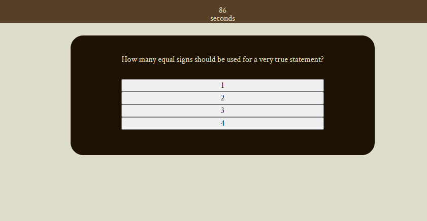

# JavaScript Quiz

## Description

When the 'Start' button is pressed, questions are displayed and a timer begins counting down. When the timer reaches zero or all questions have been answered, the quiz ends and the user can enter their intials. Their score will be proudly displayed.

## Installation

N/A

## Usage

To use, simply visit: https://wir3s.github.io/javascript-quiz/
Click the 'Start' button and the quiz will begin.

## Credit

An instructional tutor, Alexis Gonzalez, was exceedingly helpful in the final stages of the project providing helpful demonstrations of various functions.

## License

MIT License

Copyright (c) 2022 Wir3s

Permission is hereby granted, free of charge, to any person obtaining a copy
of this software and associated documentation files (the "Software"), to deal
in the Software without restriction, including without limitation the rights
to use, copy, modify, merge, publish, distribute, sublicense, and/or sell
copies of the Software, and to permit persons to whom the Software is
furnished to do so, subject to the following conditions:

The above copyright notice and this permission notice shall be included in all
copies or substantial portions of the Software.

THE SOFTWARE IS PROVIDED "AS IS", WITHOUT WARRANTY OF ANY KIND, EXPRESS OR
IMPLIED, INCLUDING BUT NOT LIMITED TO THE WARRANTIES OF MERCHANTABILITY,
FITNESS FOR A PARTICULAR PURPOSE AND NONINFRINGEMENT. IN NO EVENT SHALL THE
AUTHORS OR COPYRIGHT HOLDERS BE LIABLE FOR ANY CLAIM, DAMAGES OR OTHER
LIABILITY, WHETHER IN AN ACTION OF CONTRACT, TORT OR OTHERWISE, ARISING FROM,
OUT OF OR IN CONNECTION WITH THE SOFTWARE OR THE USE OR OTHER DEALINGS IN THE
SOFTWARE.
